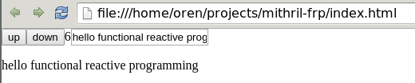

# mithril-frp

Integrate FRP with Mithril using kefir.js

## Run

    open index.html

## FRP

davexunit on #mithriljs

    http://elm-lang.org/learn/What-is-FRP.elm
    it uses slightly different terminology
    people call the time-varying values different things: signals, behaviors, streams, properties, observables, etc.
    FRP is about describing relationships.  in FRP terms, "a = b + c" means "a is *always* equal to the sum of the current values of b and c." so if b changes, it will be reflected on a. the sum would be recomputed.

    up is the return value of Kefir.emitter() which is a Kefir stream. it's a container for values.
    when up is clicked, 1 is emitted

    so we have 2 things: the first always emits 1, the other always emits -1.
    we merge those into a single stream
    so this new stream emits whenever either of those emitters do
    then we use 'scan' to build up a sum.  scan performs a fold, meaning that it uses the value it previously held to calculate the next value.
    here, we are adding the previous value of counter to the value emitted from the merged stream
    this has the effect of incrementing/decrementing the counter
